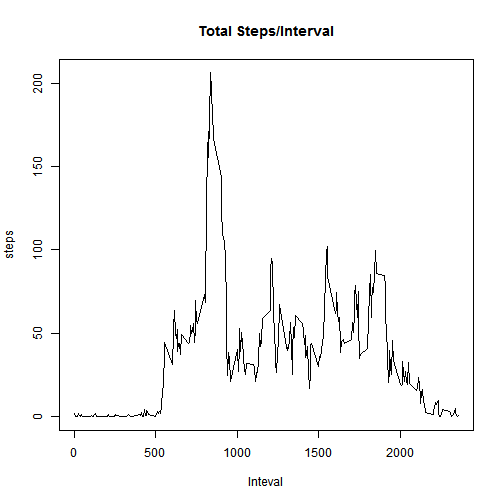
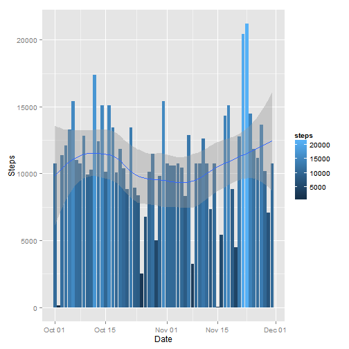
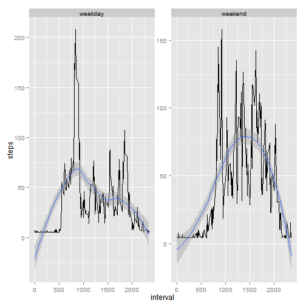

Assignment 1
========================================================
The goal of this assignment is provide personal activity analysis based on the data collected  from a personal activity monitoring device.  People who take measurements about themselves regularly to improve their health or to find patterns in their behavior. This assignment makes use of data from a personal activity monitoring device. This device collects data at 5 minute intervals through out the day. The data consists of two months of data from an anonymous individual collected during the months of October and November, 2012 and include the number of steps taken in 5 minute intervals each day. 

# Data
The data for this assignment can be downloaded from the course web site:

·  Dataset: Activity monitoring data [52K]

The variables included in this dataset are:

· steps: Number of steps taking in a 5-minute interval (missing values are coded as NA)

·	date: The date on which the measurement was taken in YYYY-MM-DD format

·	interval: Identifier for the 5-minute interval in which measurement was taken

The dataset is stored in a comma-separated-value (CSV) file and there are a total of 17,568 observations in this dataset.


```r
library("ggplot2")

df <- read.csv("activity.csv", sep =",", header = TRUE )
df$date <- as.Date(df$date)
```

Here is a histogram that shows the total number of steps taken each day


```r
sumByDay <- aggregate(steps ~ date, data = df, FUN = sum, na.rm = TRUE)
g <- ggplot(sumByDay, aes(x=date, y=steps)) + 
            geom_histogram(stat="identity", position="identity", aes(fill=steps,)) +
                           labs(x = "Date", y = "Steps") +
            geom_smooth(method = loess
                        )
g
```

 

On average, this person walked 37.3826 steps per day.


```r
meanByDay <- mean(df$steps, na.rm=TRUE)
```

Here is the median based on the total number of steps walked per day. (Any interval that had 0 step was not included)


```r
df0 <- subset(df, !df$steps==0)
medianByDay <- median(df0$steps, na.rm=TRUE)
medianByDay
```

```
## [1] 56
```

Here is a time series plot (i.e. type = "l") of the 5-minute interval (x-axis) and the average number of steps taken, averaged across all days (y-axis)


```r
meanByInt <- aggregate(steps ~ interval, data = df, mean, na.rm = TRUE)
with(meanByInt, plot(meanByInt$interval, meanByInt$steps, type = "l", xlab = "Inteval", ylab="steps", main="Total Steps/Interval"))
```

 

```r
max <- meanByInt[which.max(meanByInt$steps), ]
mInterval <- max$interval
```

On average across all the days in the dataset, at time interval 835 contains the maximum number of steps.


```r
na_df <- subset(df, is.na(df$steps))
```
out of 17568 rows in this dataset, there are 2304 rows with mising data. Now we will poupulate the missing data with the average, and re-do the analysis. Let's see if the updated data set would show any differences from the original data analysis


```r
df1 <- df

df1$steps[is.na(df1$steps)] <-  mean(df$steps, na.rm=TRUE)

meanByDay1 <- mean(df1$steps, na.rm=TRUE)
```

The mean for the dataset remains the same as 37.3826.


```r
df01 <- subset(df1, !df1$steps==0)
medianByDay1 <- median(df01$steps, na.rm=TRUE)
```

The median is now has the same value as the average: 37.3826.


```r
sumByDay1 <- aggregate(steps ~ date, data = df1, FUN = sum, na.rm = TRUE)
g1 <- ggplot(sumByDay1, aes(x=date, y=steps)) + 
            geom_histogram(stat="identity", 
                           position="identity",
                           aes(fill=steps,)) +
                           labs(x = "Date", y = "Steps") +
            geom_smooth(method = loess)
g1
```

 

Compare both histograms, the second one has more data populated, however, the general distributation(based on the geom_smooth()) remian the same.  

Now, let's take a look at the diffent activity measurement between the weekday and weekend, are they any different? 


```r
df2<- df1

day <- weekdays(as.Date(df2$date))
day <- replace(day, day %in% c("Saturday", "Sunday"), "weekend")
day <- replace(day, !day %in% c("Saturday", "Sunday", "weekend"), "weekday")
df2 <- cbind (df2, day)
```

```r
meanByInt2 <- aggregate(steps ~ interval + day, data = df2, mean)
g2 <- ggplot(meanByInt2, aes(interval, steps)) +
     geom_line(stat="identity") + facet_wrap(~day, scale = "free") +  
     geom_smooth(method = loess)
g2
```

 

Based on the diagrams above, on the weekday, most of the activities occurred around 8:30am in the morning, and on the weekend, the activites seemed spread out throught out the entire day between 8am and 8pm.
